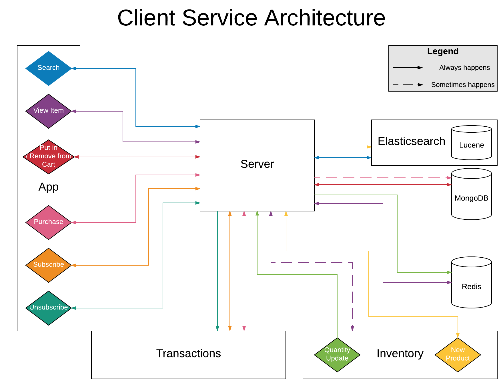

# Amazon Client Service

This repo is a clone of Amazon.com's client service.  It is meant to replicate the handling of all major events generated by the client application while a user is buying a product, subscribing for a free trial of Amazon Prime, and unsubscribing from their free trial of Amazon Prime.

This service generates all application data needed to answer the question:

On a week by week basis, do users who spend more than $100 on products at the time of Prime membership signup convert to a full Prime membership more often than those who spend less than $100?

## Roadmap

The proejct's roadmap can be found [here](LINK_TO_DOC)

The Roadmap is broken into an overall App plan first, and then into individual service plans.  The service plan for this repo is referred to as "Client."

## Contributing

See [CONTRIBUTING.md](CONTRIBUTING.md) for contribution guidelines.

# Table of Contents

1. [Usage](#Usage)
1. [Requirements](#requirements)
1. [Development](#development)
    1. [Installing Dependencies](#installing-dependencies)
    1. [Tasks](#tasks)

## Usage

> Some usage instructions

## Requirements

- Node 9.2.0
- Express 4.16.2
- Redis 3.2.x
- MongoDB 3.0.0-rc0
- Mongoose 4.13.7

## Service Architecture

## Other Information

(TODO: fill this out with details about your project. Suggested ideas: architecture diagram, schema, and any other details from your app plan that sound interesting.)

